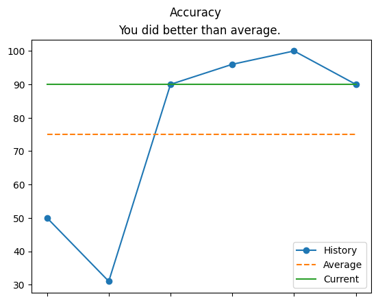
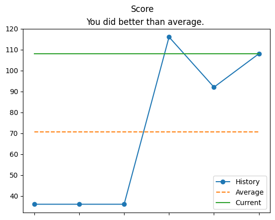
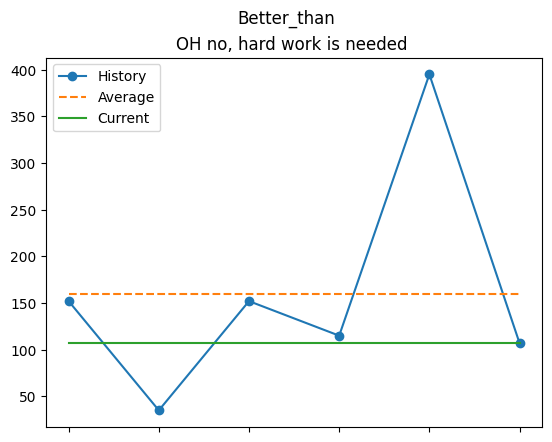
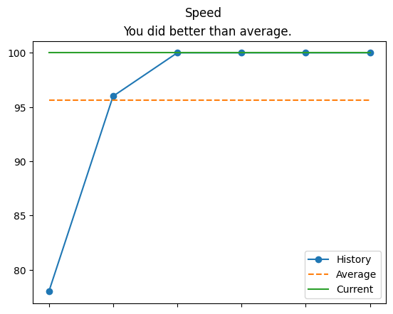
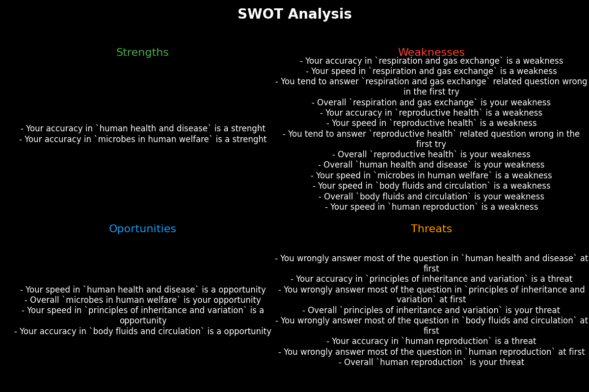
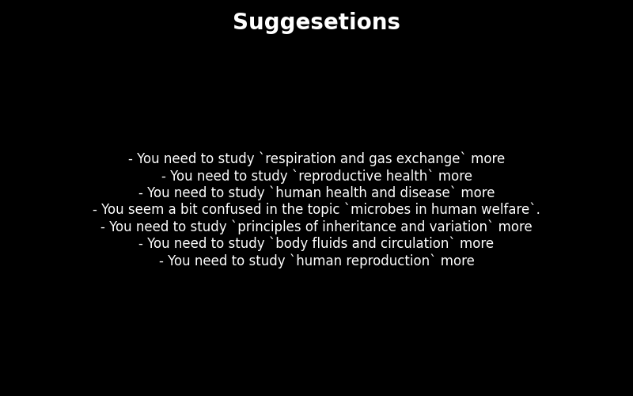

# Student Quiz Tracker and Recommender

## Setup

Clone the repository and enter the folder

```bash
git clone 
cd 
```

Install the requirements 

```bash
pip install -r requiremets.txt
```

Now you can import it at the top and start working

```python
from trackers import Tracker, QuizTracker, TopicTracker, MassTracker
```
Or you can directly run analysis from the terminal by typing
```bash
python report.py [API_ENDPOINT_JSON_OR_API_LINK] --quiz-to-check [QUIZ_TO_CHECK_JSON_OR_API_LINK]
```
Example :
```bash
python report.py  https://api.jsonserve.com/XgAgFJ --quiz-to-check .\jsons\dummy_check.json 
```


## Project Overview

This project aims to generate the strengths and weakness of a student based on the quiz they take and also suggest few points where the student can work on, that to completely **offline**.

No API Keys are required for the functioning of this program

#### Requirements

* The answers to the quiz json or any respose from any API should be in the [given example format](./jsons/dummy_check.json).

* This program also assumes that all the data that will be fed to the program belongs to the same person.


## How does it work?

The package contains 4 classes :
* Tracker 
* QuizTracker
* TopicTracker
* MassTracker

`Tracker` is the base class of all the classes which provides the core functionality like extracting usefull information from the json, aggregating it in seperate containers access of any particular quiz, etc.

`QuizTracker` is a specialized tracker which is used when a person wants to track his/her progress if they take an particular test again and again.
It has features to add a quiz, compare a quiz with the past attempts and analyze all the attempts.

`TopicTracker` is a specialized tracker that is used to tracker all the quizes that belong to the same topic. This is usefull to understand the broader picture of the person's performance of the whole topic rather than looking only at the quiz.
It also provides the functionality to add and show quizes the person has taken. We can also compare any quiz with the past performance of the student on the topic if possible and generates graphs.

|  |  |
| --- | --- |
|  |  |
 


`MassTracker` is a specialized tracker which takes all the past quizes a person has taken and automatically clusters it into topic-wise trackers and allows much easier handelling features to the user.
It provides functionality to add and compare a quiz by its respective TopicTracker if possible. It also generates **SWOT Analysis** for all the topics and also converts it into a nice visual and saves it 




--------
Suggestions Welcomed 😊